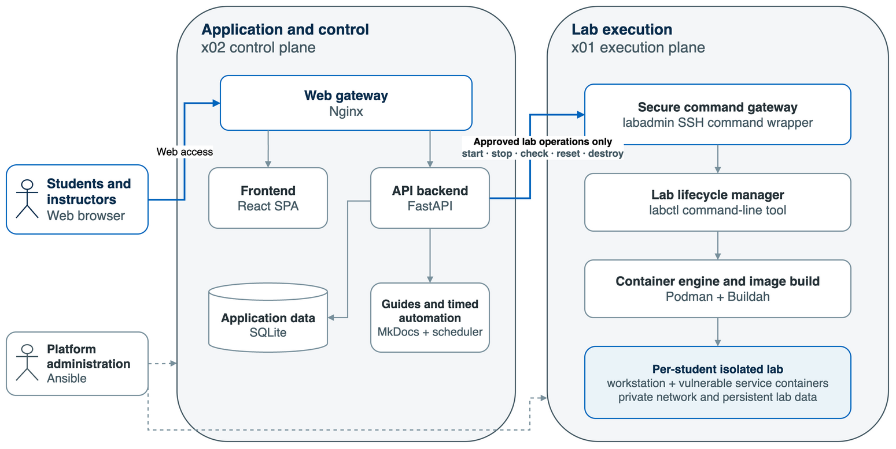
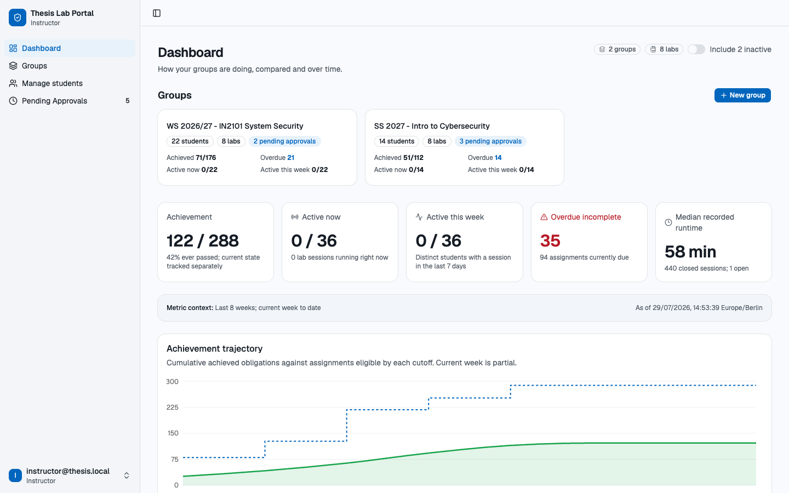
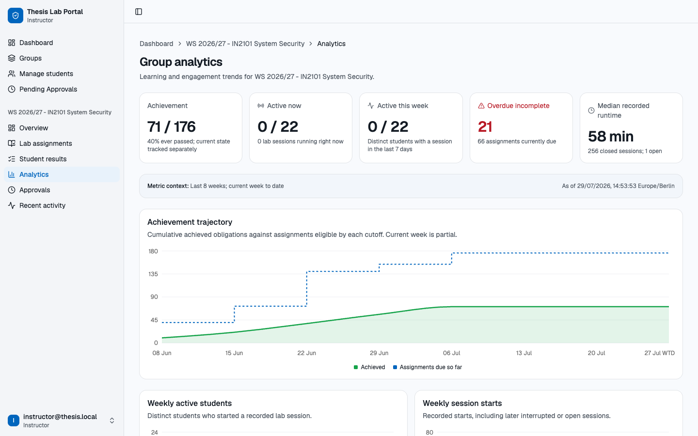
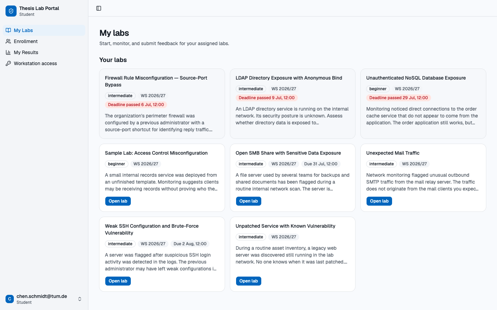

# Containerized Cybersecurity Training Platform

A VM-hosted, container-first platform for delivering isolated, vulnerable-by-design
cybersecurity labs. Students investigate and remediate realistic Linux service
misconfigurations from a browser-based workstation while instructors manage cohorts,
assignments, deadlines, results, feedback, and evidence through one web portal.

The platform separates application control from vulnerable workload execution. A
management VM runs the portal and documentation, while a dedicated worker VM creates a
private Podman environment for each student and lab.

> [!WARNING]
> This repository intentionally contains vulnerable service configurations for isolated
> training. Deploy only on controlled infrastructure behind an appropriate network
> boundary. Do not expose lab services or the portal directly to the public Internet.

## Features

-   Per-student Podman containers, private networks, persistent volumes, and deterministic
    endpoint allocation.
-   Declarative lab packages with topology, images, resource limits, lifecycle policy,
    objective checks, and guardrail checks in `scenario.yaml`.
-   Start, stop, reset, end, status, and check operations through the reusable `labctl`
    lifecycle controller.
-   Restricted management-to-worker SSH gateway that permits approved `labctl` commands
    instead of general shell access.
-   React 19 portal with student, instructor, and administrator interfaces.
-   FastAPI backend with SQLite-backed identity, enrollment, groups, assignments,
    deadlines, sessions, runtime leases, feedback, and normalized evidence.
-   Browser terminal access through Nginx and ttyd, with an SSH fallback for students that
    Nginx forwards to the student's workstation.
-   Instructor analytics, progress views, privacy-aware feedback aggregation, CSV export,
    and evidence bundles.
-   Runtime scheduling for idle limits, maximum session duration, and stopped-instance
    retention.
-   MkDocs student guides plus protected instructor guides and solution notes.
-   Reproducible RHEL provisioning and deployment through Ansible.
-   Thirteen training scenarios and four runnable authoring samples covering standalone,
    dependent-service, segmented-network, and custom-workstation patterns.

## Architecture



The deployment uses two trust zones:

| Plane                   | Default host | Responsibilities                                                                            |
| ----------------------- | ------------ | ------------------------------------------------------------------------------------------- |
| Application and control | `x02`        | Nginx, React SPA, FastAPI, SQLite, MkDocs, scheduler, evidence, and Ansible control         |
| Lab execution           | `x01`        | Restricted SSH command gateway, `labctl`, Podman/Buildah, images, and isolated student labs |

1. Students and instructors access Nginx on the management plane.
2. Nginx serves the React application and forwards API, documentation, terminal, and
   lab application traffic (`/lab-app/<port>/`). Terminal and application requests pass
   only after FastAPI confirms that the signed-in student owns the port. Nginx also
   forwards the per-student SSH ports to the worker.
3. FastAPI keeps identity, assignments, lifecycle state, and evidence in local SQLite
   storage on `x02`.
4. Lifecycle mutations cross the host boundary through a forced-command SSH wrapper.
   Only validated lab IDs, student IDs, and approved verbs reach `labctl`.
5. `labctl` validates the scenario contract, starts the containers in dependency order,
   and waits for each health check. Each student receives a workstation, vulnerable
   service containers, private networking, and resettable persistent data.
6. `x01` admits new connections to the per-student port ranges only from `x02`
   (nftables table `thesis_lab_guard`), so every student path runs through Nginx.

Vulnerable services run only inside lab containers. The management and worker hosts do
not require vulnerable packages installed directly on their operating systems.

## Dashboard Sample Screenshots





## Technology Stack

| Layer         | Technology                                                   |
| ------------- | ------------------------------------------------------------ |
| Frontend      | React 19, TypeScript, Vite, Tailwind CSS, Radix UI, Recharts |
| Backend       | FastAPI, SQLAlchemy, SQLite, Uvicorn                         |
| Runtime       | Podman, Buildah, systemd                                     |
| Provisioning  | Ansible                                                      |
| Documentation | MkDocs, PyMdown Extensions                                   |
| Validation    | pre-commit, Ruff, Bandit, JSON Schema, Ansible Lint          |
| Target hosts  | RHEL 9.6 on `ppc64le`                                        |

## Repository Layout

```text
.
|-- config/            Development, lint, Ansible, and MkDocs configuration
|-- controller/        FastAPI portal, React SPA, labctl CLI, and lifecycle library
|-- docs/              MkDocs pages and lab-guide include stubs
|-- infra/             Ansible inventory, playbooks, roles, templates, and variables
|-- labs/              Scenario packages, images, checks, seeds, and co-located guides
|-- platform-images/   Shared workstation and service base images
|-- resources/         Research sources and scenario-selection traceability
|-- tests/             Executable backend and authoring contract checks
`-- tools/             Scenario scaffolding, fixture generation, and repository validators
```

## Prerequisites

### Local development

-   Python 3.9 or newer
-   Node.js 20 or newer with npm
-   A POSIX-compatible shell

### Full deployment

-   Two reachable RHEL 9.6 `ppc64le` hosts
-   Root SSH access from the Ansible control machine
-   Podman and Buildah availability through configured RHEL repositories
-   A private network or VPN between users, management host, and worker host
-   Users reach the management host on 443; the per-student SSH ports (base + student
    number for every lab's `ssh_port_base`) must also be reachable there for the SSH
    fallback
-   The management host reaches the worker on 22 and on the per-student lab port ranges
-   SELinux may stay enforcing: provisioning labels the SSH port ranges for Nginx

The committed inventory contains deployment-specific example addresses. Replace them
before provisioning another environment. Put host credentials in `infra/host_vars/`;
that directory is ignored by Git.

## Local Development

Local development runs the real FastAPI and React applications. Worker-dependent
lifecycle actions still require a reachable lab worker, but authentication, enrollment,
administration, result views, and most portal behavior can be developed locally.

### 1. Install dependencies

```bash
git clone <repository-url>
cd "Containerized Cybersecurity Training Platform"

python3 -m venv .venv
. .venv/bin/activate
python -m pip install --upgrade pip
python -m pip install -r config/requirements-dev.txt -r controller/requirements.txt

npm ci --prefix controller/lab-portal-ui
```

### 2. Start the API

Use disposable state under the ignored `state/` directory:

```bash
mkdir -p state/local-dev/results

export PORTAL_DB_PATH="$PWD/state/local-dev/portal.db"
export LABS_DIR="$PWD/labs"
export RESULTS_DIR="$PWD/state/local-dev/results"
export EVENT_LOG_PATH="$PWD/state/local-dev/portal-events.jsonl"
export ENABLE_SCHEDULER=false

.venv/bin/uvicorn app.main:app \
  --app-dir controller/lab-controller-api \
  --host 127.0.0.1 \
  --port 8000 \
  --reload
```

On first startup, the backend creates a local SQLite database and bootstraps an
administrator account. Read the generated one-time password from the API log and change
it after signing in.

### 3. Start the frontend

In a second terminal:

```bash
npm --prefix controller/lab-portal-ui run dev
```

Open <http://127.0.0.1:5173>. Vite proxies `/api`, `/terminal`, `/internal`, and
`/logout` to FastAPI on port 8000.

### 4. Build documentation locally

```bash
.venv/bin/mkdocs serve -f config/mkdocs.yml
```

MkDocs prints the local documentation URL when the server starts.

## Validation

Run repository checks from the project root:

```bash
.venv/bin/pre-commit run --all-files

PYTHONPATH=controller .venv/bin/python tools/pre_commit/validate_scenarios.py

for test_file in tests/test_*.py; do
  PYTHONPATH=controller:. .venv/bin/python "$test_file"
done

controller/lab-portal-ui/node_modules/.bin/tsc \
  -p controller/lab-portal-ui/tsconfig.json \
  --noEmit
npm --prefix controller/lab-portal-ui run build

ANSIBLE_CONFIG=config/ansible.cfg \
  .venv/bin/ansible-playbook infra/playbooks/site.yml --syntax-check
ANSIBLE_CONFIG=config/ansible.cfg \
  .venv/bin/ansible-playbook infra/playbooks/management.yml --syntax-check
ANSIBLE_CONFIG=config/ansible.cfg \
  .venv/bin/ansible-playbook infra/playbooks/lab-worker.yml --syntax-check
```

The Python files in `tests/` are executable contract checks rather than a pytest suite.

## Deployment

Review `infra/inventory.ini` and `infra/group_vars/all.yml`, then provision both hosts:

```bash
ANSIBLE_CONFIG=config/ansible.cfg \
  .venv/bin/ansible-playbook infra/playbooks/site.yml --check --diff

ANSIBLE_CONFIG=config/ansible.cfg \
  .venv/bin/ansible-playbook infra/playbooks/site.yml

ANSIBLE_CONFIG=config/ansible.cfg \
  .venv/bin/ansible-playbook infra/playbooks/verify-platform.yml
```

Use targeted deployments during development:

```bash
# FastAPI, portal Python code, and scenario metadata
ANSIBLE_CONFIG=config/ansible.cfg \
  .venv/bin/ansible-playbook infra/playbooks/management.yml --tags portal-api

# React production bundle
ANSIBLE_CONFIG=config/ansible.cfg \
  .venv/bin/ansible-playbook infra/playbooks/management.yml --tags portal-ui

# Documentation only
ANSIBLE_CONFIG=config/ansible.cfg \
  .venv/bin/ansible-playbook infra/playbooks/management.yml --tags docs

# Worker scenario source and images
ANSIBLE_CONFIG=config/ansible.cfg \
  .venv/bin/ansible-playbook infra/playbooks/lab-worker.yml --tags lab-source,lab-images
```

Generated credentials, databases, manifests, logs, evidence exports, and private keys
must remain outside Git.

## Creating a Lab

Create a schema-valid runnable package from the standalone sample:

```bash
python3 tools/create_lab.py <lab-id> \
  --title "<Human-readable title>" \
  --difficulty beginner
```

Then replace sample-specific services, checks, and documentation while keeping the
package runnable. The complete authoring guide starts at
[`docs/instructor/new-lab-setup/index.md`](docs/instructor/new-lab-setup/index.md).
Machine-readable requirements are defined by
[`labs/templates-contract/scenario.schema.json`](labs/templates-contract/scenario.schema.json).

Every scenario should include:

-   `scenario.yaml`
-   Container build and baseline configuration files
-   `intentional-risk-allowlist.yaml`
-   `docs/student-guide.md`
-   `docs/instructor-guide.md`
-   `docs/solution-notes.md`

## Security Model

-   No privileged or host-networked lab containers.
-   No container runtime socket mounts or unrestricted host bind mounts.
-   CPU and memory limits are required for scenario services.
-   Scenario contract rules (resource limits, unique names, forbidden capabilities and
    mounts, objective checks, image-to-service mapping) are enforced when `labctl` loads a
    lab and before images are built, not only in pre-commit.
-   The worker SSH key is restricted to a forced command with forwarding disabled. The
    wrapper logs every accepted and refused command line to syslog.
-   The session-signing secret is generated on the management host at provisioning
    (`/etc/thesis-labs/portal-session.key`, root-only). Rotate it with
    `-e thesis_portal_rotate_session_secret=true`.
-   Lab passwords reach the worker on stdin and are never written to its files.
-   Evidence exports are always pseudonymized, scoped to one group the instructor owns,
    and include feedback only for labs with at least five responses.
-   Student lifecycle requests derive identity from the authenticated portal session.
-   Terminal authorization is checked against the student's active runtime lease.
-   Instructor guides, solution notes, analytics, and evidence exports require an
    instructor session.
-   Training data and credentials must be synthetic.

The current deployment model assumes a trusted private network. Public deployment needs
additional TLS, cookie, secret-management, firewall, abuse-control, and capacity review.

## Data and Maintenance

SQLite on the management host is authoritative for portal data. Startup performs
idempotent schema compatibility checks so existing installations can receive additive
columns and privacy backfills safely. Canonical synthetic demo loading is explicit and
disabled by default because it replaces portal state.

Operational state is stored under `/var/lib/thesis-labs`, logs under
`/var/log/thesis-labs`, configuration under `/etc/thesis-labs`, and deployed source under
`/opt/thesis-labs` by default.

## Contributing

1. Keep changes scoped to one platform area or scenario.
2. Add or update executable contract checks for behavior changes.
3. Run local validation and all Ansible syntax checks.
4. Never commit generated state, credentials, logs, or rendered manifests.
5. For scenario changes, verify vulnerable, fixed, guardrail-failure, reset, and cleanup
   behavior before deployment.

## License

Licensed under the [MIT License](LICENSE).
